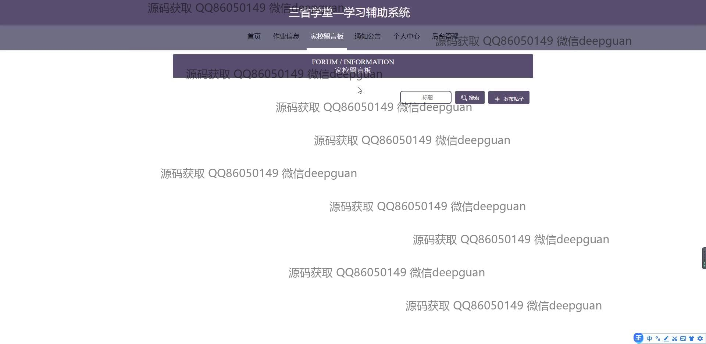
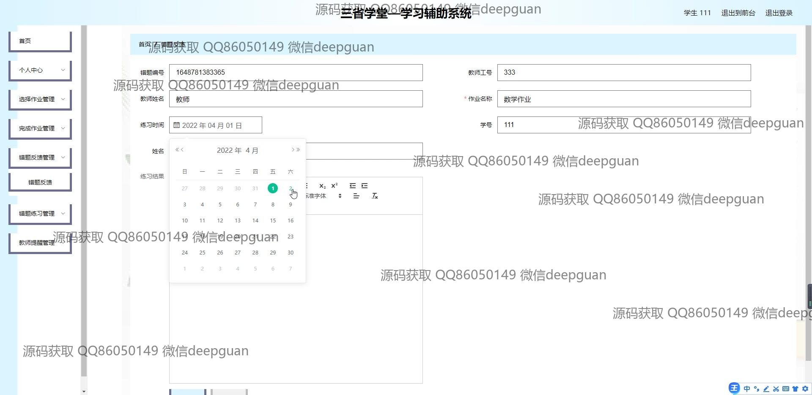

<h1 align="center">三省学堂—学习辅助系统</h1>

## 简介
三省学堂—学习辅助系统：集成学生管理、家校交流、作业及错题管理和用户个性化配置，提升沟通与管理效率，支持教师、学生、家长多角色操作。    --计算机毕业设计源码；毕设源码；java毕业设计源码

## 联系方式

<h3 align="center">获取完整代码与数据库文件 + 微信：deepguan QQ: 86050149 QQ群: 783742310</h3>

<h3 align="center">可帮忙远程部署 包运行成功！提供远程部署、修改代码、设计文档指导、代码讲解等服务！</h3>

## 功能介绍（完整见运行截图）
管理员：提供登录、注册、退出功能；管理学生、家长和教师信息，包括新增、删除和修改操作；支持作业信息管理、通知公告发布、后台账户管理等功能；可查看家校留言和处理反馈，审核作业和用户活动日志。

教师：支持登录、注册和信息管理功能；可以发布、编辑和管理作业，包括作业的编号、要求和发布时间；可查看错题反馈和练习记录，管理题库并审核学生提交的作业；通过系统查询学生完成作业情况并记录教学反馈。

学生：支持登录、注册和个人信息修改功能；可查看和完成教师发布的作业，提交作业答案并查看相关反馈；支持参与家校留言板交流、查看通知公告和错题练习记录，提升学习效率。

家长：支持登录、注册和基本信息管理；可通过家校留言板与教师沟通，查看通知公告和学生作业完成情况；参与留言互动和提交意见反馈，促进与学校的高效沟通。

## 运行截图

本代码来源于网络,仅供学习参考使用!

